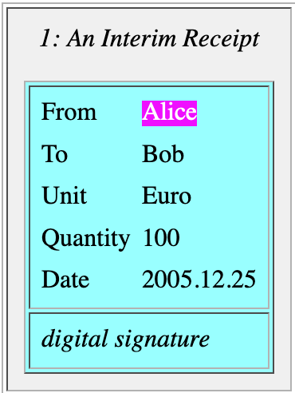
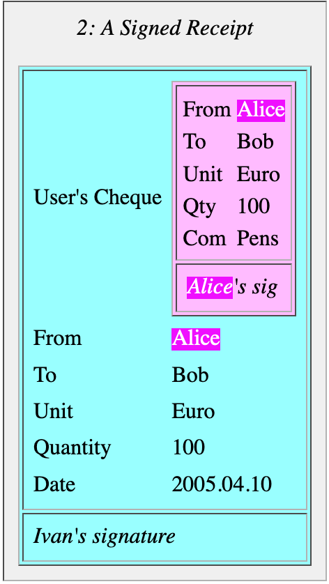
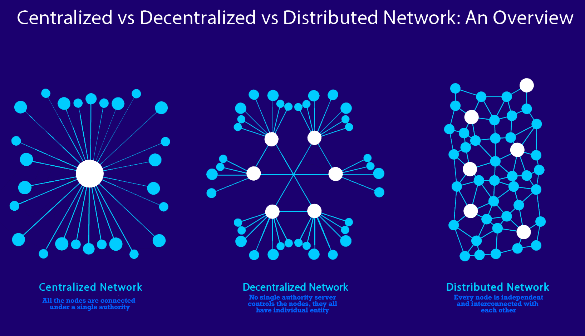
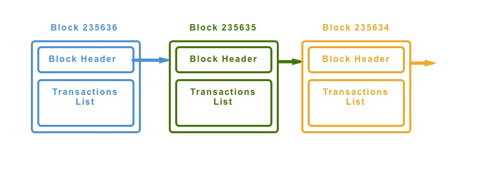
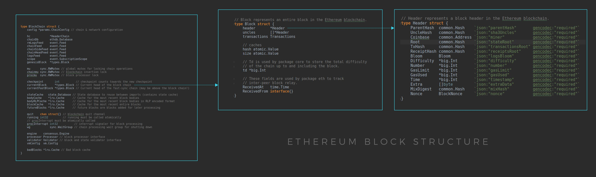
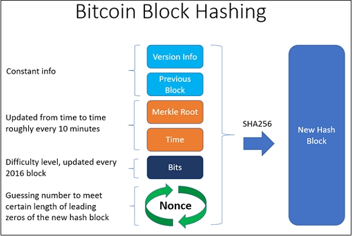

# Distributed ledger technology and Blockchain

Abréviation: DLT
En français: Registre distribué

Les blockchains sont toutes des DLT, mais tous les DLT ne sont pas des blockchains.
Dans le cadre de cette formation nous ne parlerons que des DLT qui sont des blockchains, tel que la blockchain Bitcoin et Ethereum.  
DLT et Blockchain sont donc des mots interchangeables dans le cadre de cette formation.

# Genesis

Bitcoin, la première blockchain, est `A Peer-to-Peer Electronic Cash System`.
`Electronic Cash System`: un système de paiement électronique.  
`peer-to-peer`: pair à pair, dans un réseau distribué, donc sans autorité intermédiaire de contrôle ou de remédiation.

De nombreuses idées et technologies doivent être implémentées pour arriver à construire ce système sans failles.
`Satoshi Nakamoto`, le pseudonyme utilisé par le prétendu auteur des spécifications pour Bitcoin dans le [white paper](https://bitcoin.org/bitcoin.pdf), décrit un ensemble de concepts qui existent déjà, mais qui sont ingénieusement assemblés pour construire ce nouveau système en créant le concept de Blockchain.

## Open-source, free software and communauty

Pour que ce système soit fiable et transparent, et que chacun puisse si nécéssaire examiner, corriger ou contribuer, il faut que l'implémentation en code soit open-source.
Le code source du client [BitcoinCore](https://bitcoincore.org/) est hébergé sur Github à l'adresse: https://github.com/bitcoin/bitcoin/  
Le client est également téléchargable gratuitement et un installer est disponible sur l'adresse officielle [ici](https://bitcoincore.org/en/download/)
Puisque le protocole Bitcoin est public et est accessible à tous, d'autres clients existent. Le plus populaire et officiel est `BitcoinCore`.  
Puisque le code est sur un repository github, et que des droits de modifications sur le repository sont exclusifs à certains core developers il existe évidement une certaine centralisation, mais qui est nécéssaire.  
La communauté est invitée a contribuer et inspecter les commits ou à proposer de nouvelles fonctionnalités si elle le souhaite.

## Triple-Entry Bookkeeping

La comptabilité à triple entrée est une invention de [Yuji Ijiri](https://en.wikipedia.org/wiki/Yuji_Ijiri) formalisée dans son livre blanc: ` Momentum accounting and triple-entry bookkeeping: exploring the dynamic structure of accounting measurements` en 1989. Pour l'invention de ce nouveau système de comptabilité, il fut introduit au `Accounting Hall of Fame` en 1989.
Bien que révolutionnaire, l'idée est inapplicable en son temps.
Mais c'est `Ian Grigg`, un cryptographe spécialisé en finance, qui a repensé le concept de comptabilité à triple entrée en y ajoutant le mécanisme de signature numérique en 2005. Son système sera le composant essentiel des transactions de pair à pair et du tracking des balances dans la blockchain Bitcoin.
Une description très précise de son système est disponible sur son site personnel: https://iang.org/papers/triple_entry.html

### Unique-Entry and Double-Entry Bookkepping

La comptabilité à double entrée est le système comptable utilisé actuellement. Il consiste à garder une trace des crédits et débits dans un registre, mais contrairement à la comptabilité à entrée unique un crédit sur un compte entraîne obligatoirement un débit sur un autre.  
Afin de confirmer la cohérence d'une entrée dans un registre comptable à double entrée il faut vérifier l'ensemble des registres de tous les intermédiaires qui incluent cette transaction.  
Par exemple pour auditer convenablement un transfert d'argent du compte en banque d'Alice vers le compte de Bob, il faut avoir accès au registre comptable de la banque d'Alice et au registre comptable de la banque de Bob pour vérifier la cohérence de la transaction et de la mise à jours des soldes.  
Et si l'on souhaite aller encore plus loin dans l'audit de cette transaction il faudrait également remonter jusqu'aux registres des banques centrales qui ont prêté ces fonds aux banques ou vérifier la cohérence du système de réserves fractionnaires de ces banques pour vérifier qu'une falsification, fraude ou création monétaire n'a pas eu lieu.  
La seule possibilité de faire cela convenablement serait de créer un système de comptabilité mondiale qui centraliserait toutes les transactions. Mais cela n'empêcherait pas une altération de ce registre, par accident, bug, ou personne malveillante.

### The Receipt is the Transaction

Dans la comptabilité à triple entrée de `Ian Grigg` en 2005, inspiré des travaux de `Yuji Ijiri`, un mécanisme de signature numérique de reçus est ajouté à la classique comptabilité à double entrée.  
Lorsque Alice souhaite effectuer un transfert à Bob, elle signe un reçu contenant le destinataire et la somme à envoyer à Bob:  

Ce reçu est envoyé à l'institution qui gère ses fonds (sa banque) qui valide dans son registre comptable à double entrée si Alice possède bien les fonds qu'elle souhaite envoyer à Bob, effectue le transfert et émet un reçu signé à Alice et Bob et garde également une copie de ce reçu:  
  
Ivan est la banque.
Ce reçu signé contient obligatoirement l'autorisation d'Alice qu'elle a signé auparavant pour valider cette transaction.
Alice, Bob et la banque (Ivan) partage la même information.  
`Ian Grigg` affirme déjà que l'utilisation d'un registre comptable à double entrée par l'institution qui gère les fonds n'est plus nécéssaire, car un registre comptable peut être construit à la volée en fonction des reçus émis.
En consultant l'historique des reçus émis depuis le début (depuis la première transaction dans cette institution) on peut retrouver les balances de chacun.  
C'est exactement comme cela que Bitcoin fonctionne:

- Une transaction doit absolument être signée par l'expéditeur pour garantir son autorisation à effectuer cette transaction.
- Et il n'existe pas de registre à double entrée pour obtenir le solde d'un account. Le solde d'un account est obtenu en consultant l'historique de toutes les transactions signés dont l'account est l'expéditeur ou le destinataire.

En 2005 le concept de Blockchain n'existe pas encore, et on remarque que ce système bien que favorisant la lutte contre la fraude et la traçabilité est centralisé autour de l'émetteur du reçu qui valide la transaction: l'institution qui gère les fonds.  
`Ian grigg` remarque que ses travaux sont compatibles avec le `Shared Transaction Repository` théorisé par `Todd Boyle`, remplaçant ainsi l'institution qui sert d'intermédiaire.

## Shared Transaction Repository

`Todd Boyle` a théorisé en 2001 un système de registre partagé qui serait accessible à tous les participants:
https://linas.org/mirrors/www.gldialtone.com/2001.07.14/str.htm

## Elliptic curve digital signature algorithm

`ECDSA` est un algorithme de signature numérique qui est une amélioration de DSA (Digital Signature Algorithm) par l'utilisation de `Elliptic-curve cryptography` (ECC).  
Une paire de clefs privée et publique est générée par des opérations sur une courbe elliptique.
Cet algorithme a été proposée par `Scott Vanstone` en 1992. Cet algorithme est considéré comme plus performant que que `RSA` et `DSA` qui sont basés sur l'imprédictibilité et l'impossibilité (encore?) de décomposer un nombre en produit de facteurs premiers. Il offre une meilleure sécurité avec des tailles de clefs plus petites et aussi des algorithmes de générations de clefs, de signatures et de vérification de signatures plus rapides.  
La courbe elliptique utilisé pour Bitcoin, Ethereum et d'autres Blockchain est la `secp256k1` exprimée par la formule: `y² = x³+7`

La clef privée est un très grand nombre généré aléatoirement.  
**La clef privée doit absolument être tenue secrète par son propriétaire.**  
La clef publique associée est un nombre généré par un `one way algorithm` sur la clef privée par des opérations sur une courbe elliptique. Il est impossible de récupérer la clef privée à partir de la clef publique par une opération inverse.  
**La clef publique peut être partagée.**  
Les opérations consistent a additionner le point G (Generator point) à lui même un nombre de fois correspondant à la clef privée (la clef privée est un nombre). Le point d'arrivée sur la courbe sera la clef publique.  

Dans une Blockchain chaque utilisateur possède une adresse sur le réseau. Cette adresse est obtenue par une fonction de hachage, `one-way cryptographic hashing`, sur la clef publique.

ECDSA nous permet de signer nos messages grâce a notre clef privée. Notre message est ainsi envoyé à nos destinataires avec la signature et notre clef publique attachée au message.
L'algorithme de signature par ECDSA prend comme input le message et la clef privée et génère une signature.
Pour vérifier que l'on est bien l'auteur du message et de la signature associée, un destinataire peut effectuer une vérification par un algorithme de vérification de signature, `elliptic curve signature recovery`, pour récupérer la clef publique grâce au message et à la signature.  
Si la clef publique récupérée par l'algorithme de vérification est identique à la clef publique attachée au message alors ce message a bien été écrit par le propriétaire de la clé privé associée à la clef publique.

Dans une Blockchain l'utilisateur signe une transaction avant de l'envoyer au réseau.  
Le réseau reçoit la transaction avec les informations suivantes:

- l'adresse de l'utilisateur sur le réseau
- le message
- la signature de ce message par ECDSA

Pour valider que l'expéditeur est bien le propriétaire de l'adresse, les noeuds du réseau vont extraire la clef publique par un `elliptic curve signature recovery`, utiliser la fonction de hash qui permet de convertir une clef publique en adresse et vérifier que l'adresse de l'expéditeur est bien identique à l'adresse récupérée par cette vérification.

Pour convertir une clef publique en adresse bitcoin on utilise:
**A=Base58Check(RIPEMD160(SHA256(K)))**  
Avec K la clef publique et A l'adresse Bitcoin.

## Hashing and Merkle tree

En 1979 Ralph Merkle invente une structure de donnée qui permet de résumer et vérifier l'intégrité d'un ensemble de données efficacement.
Cette invention porte son nom: L'arbre de Merkle.  
Les données sont passées à une fonction de hachage.  
les hashes résultants sont concaténés a leur noeud voisin et passés à une fonction de hachage.  
Ainsi de suite jusqu'au ce qu'il ne reste plus qu'un seul hash qui sera le `Merkle root`.  

Le `Merkle root` peut ainsi être stocké et être de nouveau calculé si nécéssaire pour vérifier que les données n'ont pas été altérées. Si une donnée a été modifiée le `Merkle root` sera obligatoirement différent.
Le véritable avantage de l'arbre de Merkle est la possibilité de vérifier qu'une donnée est bien incluse dans le set initial de données qui a généré le `Merkle root` sans avoir a calculer de nouveau tous les hashes.  
Pour cela il faut produire un `Merkle path` ou `Merkle branch`. Le `Merkle path` est l'ensemble des hashes qui permettent de remonter du hash de la donnée au `Merkle root`.  

Dans l'exemple ci dessus on peut prouver que K est inclus dans le set initial de données en produisant un `Merkle path` qui contiendra 4 hashes. Le `Merkle path` consistera aux 4 hashes sur fond bleu pour prouver que HK, sur fond noir, est inclus dans le `Merkle root` en calculant hashs HKL, HIJKL, HIJKLMNOP et le `Merkle root`.

Dans Bitcoin le set de données est l'ensemble de toutes les transactions. Un Block peut contenir des milliers de transactions. Un `Merkle root` de toutes les transactions est généré et est ainsi stocké dans le `Block header`.  
Si un acteur malicieux essaye de modifier le contenu d'une transaction le `Merkle root` inscrit dans le block header ne sera plus valide.  
De plus une majorité des noeuds Bitcoin ne télécharge pas entièrement la Blockchain, mais uniquement les block headers, ce sont des `Simplified Payment Verification nodes`(SPV nodes). Les wallets bitcoin sont majoritairement des `SPV nodes`. Pour vérifier qu'une transaction existe bien dans un block un `SPV node` demande un `Merkle path` au réseau (au full nodes) incluant un lien de la transaction jusqu'au `Merkle root`.

## Distributed Computing and peer-to-peer network

`David Chaum` est l'un des pionniers dans l'implémentation de réseaux décentralisés en 1979.  
En 1983 ses travaux sur ces réseaux l'amèneront à créer la première monnaie digitale `eCash` qui sera anonyme et sécurisé par un système de cryptographie asymétrique (RSA).  
Les réseaux peer-to-peer sont exploités et popularisés par `Napster` en 1999, pour leur système de partage de fichier s'appuyant sur un véritable réseau distribué.

  
Dans un réseau distribué il n'existe pas de `single point of authority`.
L'objectif étant d'éviter une centralisation qui entrainerait obligatoirement un single point of failure: `SPOF`.  
Donc un mécanisme de consensus doit être utilisé pour être sur que tous les noeuds d'un réseau distribué travaillent ensemble et jamais d'une manière malicieuse.  
Dans une Blockchain qui sert à échanger de la monnaie ou des tokens il est impératif que le registre de compte ne puisse être falsifié. Actuellement dans Bitcoin et Ethereum c'est le consensus de `proof of work` qui est utilisé pour controlé comment les transactions peuvent être validée et écrite dans une block pour ensuite être exécutées.
Actuellement la libraire réseau la plus utilisé pour créer des réseaux peer-to-peer les [libp2p](https://libp2p.io/)

## Proof of work

Hashcash est système pour lutter contre le spam utilisant pour la première fois la `proof of work`.
Il a été proposé par `Adam Back` en 1997 et décrit en détail dans un paper publié en 2002 sur http://www.hashcash.org/papers/hashcash.pdf  
Il nécessitait de calculer un hash qui prouvait que l'expéditeur du mail a utilisé une certaine puissance de calcul de son ordinateur avant d'expédier ce mail en y incluant en entête le hash trouvé.  
La `hashcash CPU cost-function` doit être couteuse en ressource à son exécution pour celui qui envoi l'email, mais doit être facilement vérifiable pour celui qui reçoit l'email.  
Le but est évidement de décourager les spamers et les abus de ressources d'internet, rendant couteuse l'utilisation de ces ressources.  
Bitcoin utilise ce concept pour se protéger des écritures malicieuses dans la Blockchain.  
Ecrire un block est couteux en ressource informatique, mais modifier un Block l'est encore plus, car il faudra modifier les headers de tous les blocks suivants et de nouveau produire une `proof of work` pour chacun de ces blocks.  
Afin de motiver les mineurs un `reward` en bitcoin est attribué au premier mineur qui réussit à produire une `proof of work` pour le prochain Block a créer.

# Blockchain

## Principles

Le premier objectif d'une Blockchain, comme il a été pensé pour Bitcoin, est de permettre un transfert de monnaie et un système de paiement électronique peer-to-peer sans passer par un intermédiaire ou une autorité de confiance ou de contrôle.  
Un transfert de monnaie peer-to-peer était déjà techniquement possible avant même l'invention de Bitcoin, mais le problème du `double-spending` persistait sur un réseau décentralisé/distribué rendant toute application financière critique impossible ou très peu fiable.

## Double-spending

Afin de pallier au problème de la double dépense toutes les transactions sont écrites dans une Blockchain publique qui est synchronisée entre tous les noeuds du réseau.
Afin que cela soit possible il faut que:

- cette Blockchain soit immuables et que les anciennes transactions ne puissent être altérées
- le processus doit être distribué: pas de single point of authority ou de single point of failure et les noeuds doivent travailler ensemble suivant un mécanisme de consensus prévenant les actions de noeuds malveillants.

## Immutability

In a blockchain all transactions are stored in a block.
Each block includes the `cryptographic hash` of the prior block in the chain, linking the two blocks, and also a `cryptographic hash` of all the transactions stored in the block.  
The `cryptographic hash`, is a `hash` generated by a `cryptographic hash function`.  
The `cryptographic hash function` is a one way function (non invertible function) that maps the content of a block to a number.  
These 2 numbers, the `cryptographic hash` of the previous block and the `cryptographic hash` of all the confirmed transactions in the block, are stored in the `block header` of the new incoming block.  

Bellow how this kind of process can be implemented with code:

Bellow a basic overview of a block header:  

This process confirms the **integrity** of the block, all the way back to the original `genesis block`.

If a malicious actor want to alter a block, for example by changing a transaction amount, he will alter the `hash` of all the transactions within the block. So he will have to mine again this block. The process will alter the whole block `hash`, and all the following blocks will have a different `hash` stored in their header for the previous block. So the malicious actor will have to mine also all the following blocks based on the `hash` of the malicious crafted block.  
The other protection which prevent these kind of modifications is a consensus mechanism.
Attackers would need to control 51% of the network to reverse transactions that have already taken place in a blockchain.
This is known as the **51% Attack**
Needless to say that this is actually impossible, attackers would need to much computational power, and even if they succeed it would invalidate trust on this blockchain and users will just leave.

## Consensus mechanisms

### Byzantine generals problem

https://fr.wikipedia.org/wiki/Probl%C3%A8me_des_g%C3%A9n%C3%A9raux_byzantins

### Proof of work: PoW

In french: **preuve de travail**.  
This is the original consensus algorithm.  
With `PoW`, miners compete against each other to complete transactions on the network and add new blocks to the blockchain.  
Miners have to solve a difficult puzzle using their computers processing power.  
The mathematical puzzle to solve consists in finding a hash number for the current block header by manipulating the `nonce` field of this block.  
The hash number to find has to be less than a `target` hash. The `target` hash is defined by a `difficulty`.  

The first miner to solve the puzzle is given a reward for their work.  
A proof of work is a piece of data which is difficult (costly, time-consuming) to produce but easy for others to verify and which satisfies certain requirements.

### Proof of stake: PoS

In french: **preuve d'enjeu** ou **preuve de participation**.  
Proof of stake (`PoS`) is a type of consensus algorithm by which a cryptocurrency blockchain network aims to achieve distributed consensus.  
In PoS-based blockchains the creator of the next block is chosen via various combinations of random selection and wealth or age (i.e., the stake).
In the case of the Ethereum blockchain, there will be a minimum threshold of 32 ETH required to participate in staking, and validators will need to be running a validator node. This doesn’t need to be specialist machinery and could be done on a consumer-grade computer or laptop. However, validators will be expected to be online consistently or face minor penalties.  
In the case of blockchain operating a `PoS` consensus, miners/validators/stakers can mine or validate block transactions based on the amount of cryptocurrencies they holds.  
In order to add a malicious block, an attacker would have to own 51% of all the cryptocurrency on the network.

Ethereum has historically operated a proof-of-work consensus. However, one reason for moving to proof-of-stake is that it’s generally considered to be far more energy-efficient than proof-of-work.

### Fees/Gas

The fees on Bitcoin blockchain, or the `Gas` system on Ethereum blockchain, are a protection system and reward for nodes processing the transaction.
Computing costs money:

- hosting a service
- storing data
- processing information

Each transaction that modifies a state in a blockchain, like sending cryptocurrencies, deploying a smart contract or changing a value in a smart contract, will cost the sender some fees.

Another aspect of charging the user for their actions in the network is to prevent abuses. If you are paying for every operation you execute, you’ll do your best to implement your code in the most efficient way. The fee cost also prevents bad actors from flooding the system with useless operations (unless they are willing to spend a lot of money to execute useless code).
