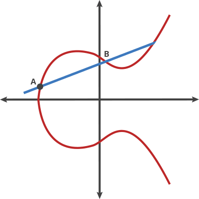

# **Introduction blockchain Ethereum**

## **DLT: Distributed ledger technology AKA Blockchain**

Blockchain technologies solved 2 problems:

- immutability: data can't be altered
- distributed process: no more a single point of authority or a single point of failure (`SPOF`), each nodes work together based on a consensus mechanism preventing malicious actors.

### **Immutability**

In a blockchain all transactions are stored in a block.
Each block includes the `cryptographic hash` of the prior block in the chain, linking the two blocks, and also a `cryptographic hash` of all the transactions stored in the block.  
The `cryptographic hash`, is a `hash` generated by a `cryptographic hash function`.  
The `cryptographic hash function` is a one way function (non invertible function) that maps the content of a block to a number.  
These 2 numbers, the `cryptographic hash` of the previous block and the `cryptographic hash` of all the confirmed transactions in the block, are stored in the `block header` of the new incoming block.  

Bellow how this kind of process can be implemented with code:

Bellow a basic overview of a block header:  


This process confirms the **integrity** of the block, all the way back to the original `genesis block`.

If a malicious actor want to alter a block, for example by changing a transaction amount, he will alter the `hash` of all the transactions within the block. So he will have to mine again this block. The process will alter the whole block `hash`, and all the following blocks will have a different `hash` stored in their header for the previous block. So the malicious actor will have to mine also all the following blocks based on the `hash` of the malicious crafted block.  
The other protection which prevent these kind of modifications is a consensus mechanism.
Attackers would need to control 51% of the network to reverse transactions that have already taken place in a blockchain.
This is known as the **51% Attack**
Needless to say that this is actually impossible, attackers would need to much computational power, and even if they succeed it would invalidate trust on this blockchain and users will just leave.

### **Centralized vs Decentralized vs Distributed**


In a Distributed network there is not a single (or even multi) point of authority.  
The objective is to avoid a single point of failure: `SPOF`
So consensus mechanisms are used to make sure that each nodes in a distributed network work together, and never in a malicious way.  
In the case of a blockchain network, consensus mechanisms are used to control how a blockchain transaction can be validated, written in a block and executed.

### **Consensus mechanisms**

#### **Byzantine generals problem**

https://fr.wikipedia.org/wiki/Probl%C3%A8me_des_g%C3%A9n%C3%A9raux_byzantins

#### **Proof of work: PoW**

In french: **preuve de travail**.  
This is the original consensus algorithm.  
With `PoW`, miners compete against each other to complete transactions on the network and add new blocks to the blockchain.  
Miners have to solve a difficult puzzle using their computers processing power.  
The mathematical puzzle to solve consists in finding a hash number for the current block header by manipulating the `nonce` field of this block.  
The hash number to find has to be less than a `target` hash. The `target` hash is defined by a `difficulty`.  


The first miner to solve the puzzle is given a reward for their work.  
A proof of work is a piece of data which is difficult (costly, time-consuming) to produce but easy for others to verify and which satisfies certain requirements.

#### **Proof of stake: PoS**

In french: **preuve d'enjeu** ou **preuve de participation**.  
Proof of stake (`PoS`) is a type of consensus algorithm by which a cryptocurrency blockchain network aims to achieve distributed consensus.  
In PoS-based blockchains the creator of the next block is chosen via various combinations of random selection and wealth or age (i.e., the stake).
In the case of the Ethereum blockchain, there will be a minimum threshold of 32 ETH required to participate in staking, and validators will need to be running a validator node. This doesn’t need to be specialist machinery and could be done on a consumer-grade computer or laptop. However, validators will be expected to be online consistently or face minor penalties.  
In the case of blockchain operating a `PoS` consensus, miners/validators/stakers can mine or validate block transactions based on the amount of cryptocurrencies they holds.  
In order to add a malicious block, an attacker would have to own 51% of all the cryptocurrency on the network.

Ethereum has historically operated a proof-of-work consensus. However, one reason for moving to proof-of-stake is that it’s generally considered to be far more energy-efficient than proof-of-work.

### **Mining**

The Miner nodes create blocks in the chain.  
A block is a data structure that contains a set of transactions. When creating a block, the miner will select some transactions from its pool of pending transactions (transactions waiting to be included in the chain) and start mining the block.  
The important thing to know is that mining is an expensive process. Therefore, if miners didn’t get anything in return for mining, no one would do it.
In Ethereum, when a miner mines a new block, it receives the fees from all transactions included in this block and a block reward (actually 2 ETH). Therefore, the higher the gasPrice in the transactions, the higher the fees that the miner receives will be.

### **Fees/Gas**

The fees on Bitcoin blockchain, or the gas on Ethereum blockchain, are a protection system and reward for nodes processing the transaction.
Computing costs money:

- hosting a service
- storing data
- processing information

Each transaction that modifies a state in a blockchain, like sending cryptocurrencies, deploying a smart contract or changing a value in a smart contract, will cost the sender some fees.

Another aspect of charging the user for their actions in the network is to prevent abuses. If you are paying for every operation you execute, you’ll do your best to implement your code in the most efficient way. The fee cost also prevents bad actors from flooding the system with useless operations (unless they are willing to spend a lot of money to execute useless code).

### **asymmetric cryptography**

The core of asymmetric cryptography is the usage of public and private key pairs.
A private key is a random number. The associated public key is a number generated by a one way algorithm based on the private key.
This algorithm is an elliptic curve digital signature algorithm (`ecdsa`).
The elliptic curve used by Bitcoin, Ethereum, and many other cryptocurrencies is called secp256k1. The equation for the secp256k1 curve is `y² = x³+7`. This curve looks like:



A private key is a big number, preferably, randomly generated.
The private key has to be kept secret.
A public key is a big number obtained by an `ecdsa` on the private key.
The public key can be shared with anyone without compromising security.
An address is obtained from a public key with a hash function.
A transaction contains the message of the transaction, and a signature of this message generated with the private key of the sender.
Anyone can verify the generated signature to:

- recover the public key and address of the signer
- verify the integrity of the message, that it is the same message that was signed by the signer.

With the signature and the hash of the original data we can perform an `elliptic curve signature recovery` and get the public key and then the address. If the address recovered is identical to the address of the sender, then the private key holder of the public key pair did indeed sign the message.

## **Ethereum**

### **Ethereum vs Bitcoin**

Technically Ethereum and Bitcoin follow the same scheme in their implementation, but there are 3 main differences between these 2 blockchains:

- Ethereum has a virtual machine which can execute instructions and store data.
- Ethereum offers the possibility of deploying and using `smart contracts`, an enhanced version of the Bitcoin `Script`. The instructions of `smart contracts` are executed in the `EVM` and data are stored in the `EVM`.
- Ethereum introduced `Gas`, an enhanced system of miners fees on Bitcoin.

### **EVM**

The Ethereum Virtual Machine (`EVM`) is a powerful, sandboxed virtual stack embedded within each full Ethereum node, responsible for executing contract bytecode. Contracts are typically written in higher level languages, like Solidity, then compiled to `EVM` bytecode.  
This means that the machine code is completely isolated from the network, filesystem or any processes of the host computer. Every node in the Ethereum network runs an `EVM` instance which allows them to agree on executing the same instructions. The `EVM` is Turing complete, which refers to a system capable of performing any logical step of a computational function.
For every instruction implemented on the `EVM`, a system that keeps track of execution cost, assigns to the instruction an associated cost in Gas units. When a user wants to initiate an execution, they reserve some Ether, which they are willing to pay for this gas cost.  
List of the EVM opcodes: https://ethervm.io/

### **Smart contracts**

A smart contract is a self-executing contract with the terms of the agreement between buyer and seller being directly written into lines of code.
Smart contracts permit trusted transactions and agreements to be carried out among disparate, anonymous parties without the need for a central authority, legal system, or external enforcement mechanism.
A smart contract is a set of functions and data stored in the EVM.  
Smart contract can execute instructions, but are limited by a small list of available opcodes and also by the `Gas limit`, the maximum amount of `Gas` a user is willing to pay.

### **Gas**

https://pegasys.tech/ethereum-explained-gas-payment-and-mining/
gasPrice:The gasPrice is the value that the transaction sender is willing to pay per gas unit.  
gasLimit: Sometimes when executing a transaction, you might not know exactly how much it is going to cost. Imagine a scenario where you have a smart contract with a bug, an infinity loop. Without a gasLimit, it would be possible to consume the whole balance of the sender account. The gasLimit is a safety mechanism to prevent someone from using all their Ether due to a bug or an estimation error.
When sending a transaction, it can be hard to know what is the minimum gasPrice at that moment. There are some tools that scan the network and the average gasPrice used in recent transactions to help with choosing a fair gasPrice that is likely to be accepted by miners.  
https://ethgasstation.info/ (install browser extension too)
https://etherscan.io/gastracker
https://addons.mozilla.org/en-US/firefox/addon/ethereum-gas-price-extension/

## **Metamask**

### **Installation**

### **Configuration**

### **Networks**

### **Faucets**

### **web3**

## **Transaction**

Depuis metamask + blockchain explorer
2 types of transaction signed and unsigned.

Unsigned transaction are free, used for reading states on the Ethereum blockchain

- Check ETH amount own an ETH address
- Read a state/value from a smart contracts

Signed transaction are mandatory for changing state on the Ethereum blockchain. Sender of the transaction have to prove that he

- Sending ETH
- Deploy a smart contracts
- Change the state of a smart contracts.

## **Remix**

On voit les réseau

## **Ganache**

Ganache is a local development Ethereum node, for fast deployment and testing. In a professional Environment `remix`is not an option.

### **Switch back to node 12**

ganache-cli doesn't work on nodejs 14 yet. So we need to switch back to nodejs 12.

### **Installation**

Install with `yarn`:

```zsh
% yarn global ganache-cli
```

To have access to Yarn’s executables globally, you will need to set up the PATH environment variable in your terminal. To do this, add the line below into your profile, in my case my profile is in `~/.zprofile`:

````zsh
export PATH="\$PATH:`yarn global bin`"
```

and then load your profile, in my case `~/.zprofile`:
```zsh
% source ~/.zprofile
````

### **Execution**

## **Deploy a Smart contract from Remix**

### **First smart contract on browser**

### **First smart contract on ganache**

### **First smart contract on a testnet**

## Glossary:

`Block header`: A data structure containing all information of a block. It is used as an identifier of a block  
`Block hash`: A Block Hash is a reference number for a block in the blockchain. You get a Block Hash by hashing the block header  
`BTC`: Bitcoin cryptocurrency  
`DAO`: Decentralized Autonomous Organization  
`cryptographic hash`: see `hash`  
`cryptographic hash function`: see `hasing function`  
`Difficulty`: This describes how difficult, in relation to the genesis block, the target will be to reach.  
`ECDSA`: Elliptic Curve Digital Signature Algorithm  
`ETH`: Ethereum/Ether cryptocurrency  
`EVM`: Ethereum Virtual Machine  
`Gas`:  
`Genesis block`: The first block of a blockchain  
`hash`: A unique identifier of a data.  
`hashing function`: take an input, file or data, and generate a `hash` of this input  
`PoW`: Proof of Work  
`PoS`: Proof of Stake  
`SPOF`: Single Point Of Failure  
`Target`: The number that the block hash must be less than in order to be valid
