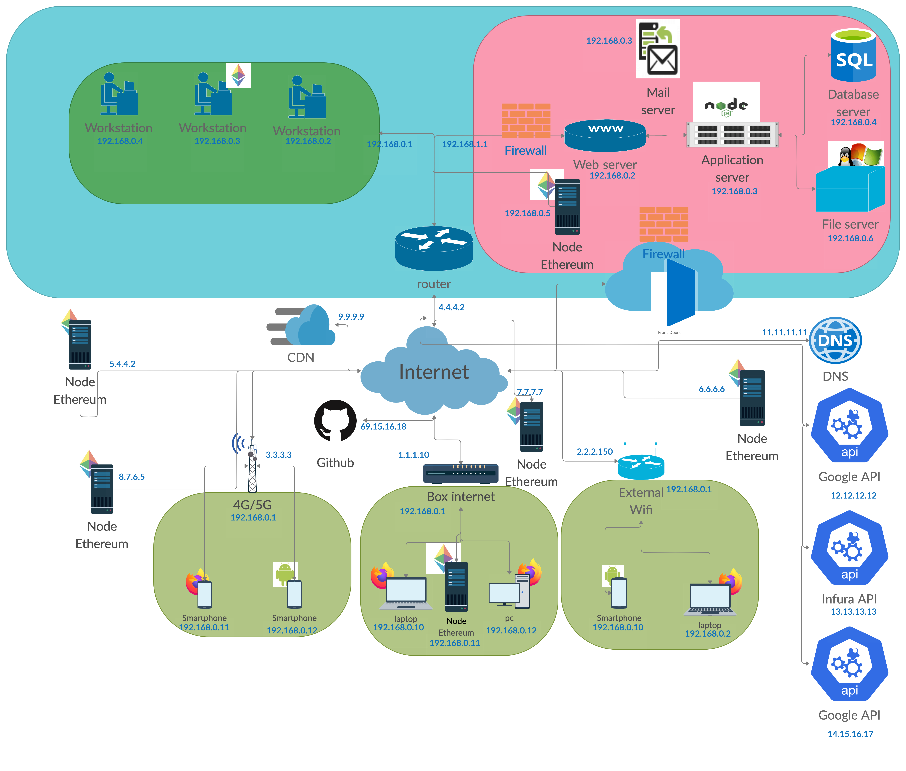
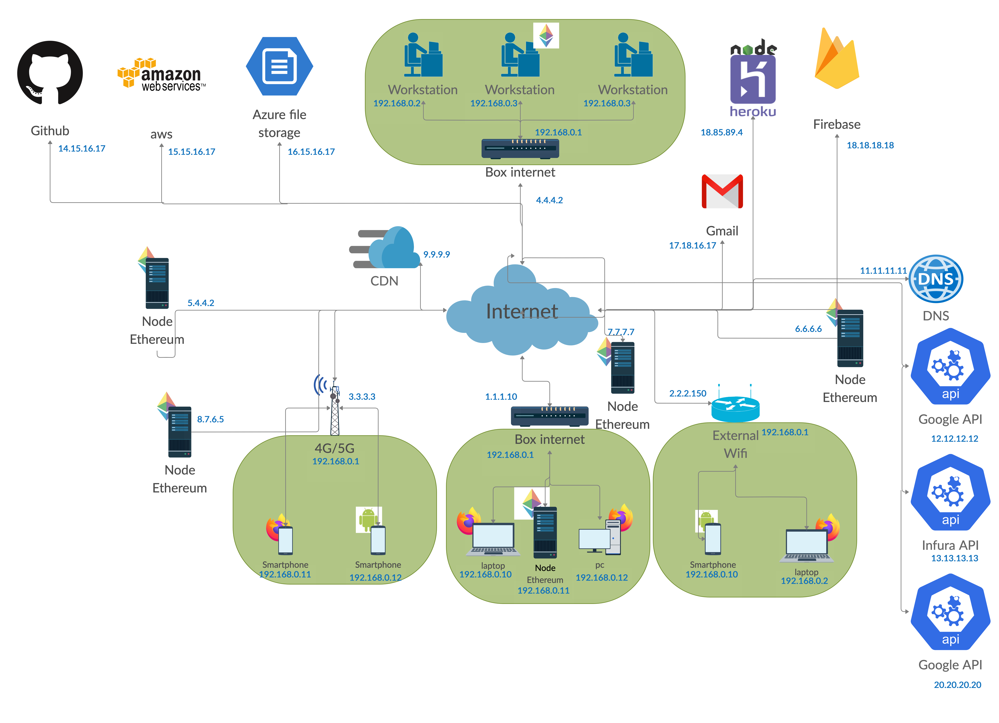
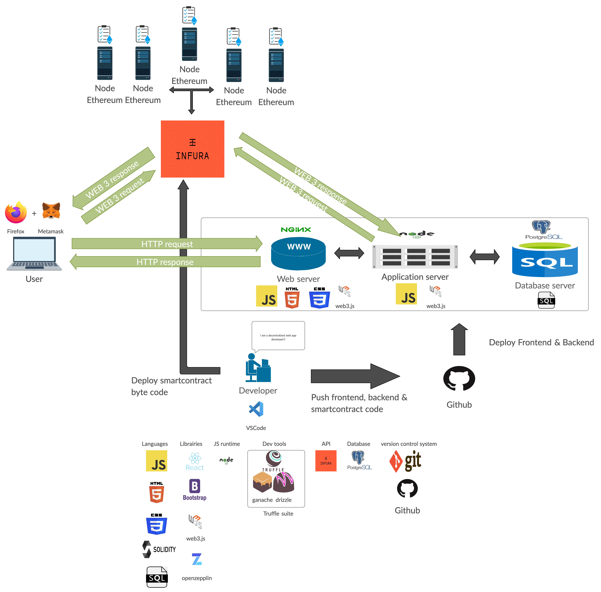

# Dapp architecture

## Standard network architecture

## Cloud network architecture: SaaS, Paas, IaaS

## Functional architecture of a decentralized web application

A Dapp developer use a wide range of technologies:

- **IDE**:  
  **VSCode**: An extensible code editor.

- **Languages**:  
  **html**: A language for structuring your web interface.  
  **css**: A language for making your web interface beautifull.  
  **javascript**: Javascript is used everywhere in a Dapp development.  
  It is use on the web interface for making your web interface dynamic, but also on the server side of your dapp.  
  **solidity** A language for smart contracts developement.  
  **SQL**: A language to access and modify data in a database.

- **Librairies**:  
  **react.js**: A library for building user interface. It generates html, css and javascript files for the front-end side.  
  **bootstrap**: A css library  
  **web3.js**: A library to interact with a local or remote ethereum node using HTTP, IPC or WebSocket. web3.js can be used on front-end and backend side of your dapp.  
  **openzepplin**: A smart contracts library and templates.

- **JS runtime**:  
  **node.js**: node.js is a javascript runtime. It is used in all stages of your dapp development process. It provides a way to execute javascript on an operating system.
  node.js is used for running server side code, project management, dependencies management, testing and much more!!!

- **Dev tools**:  
  **truffle suite**: Truffle is a framework for smart contracts developement.  
  **openzepplin sdk**: Another framework for smart contracts development.

- **API**:  
  **INFURA**: INFURA is a service for communicating with the Ethereum blockchain.
  It is a gateway between our javascript code and Ethereum.
  An alternative to INFURA would be to connect directly to an Ethereum node, but it is less scalable.

- **Database**:  
  **Postgresql**: An SQL-like database. It is used for storing persistent data.

- **Version control system**:  
  **git**: a console client for managing code version.  
  **github**: host a project initialized with **git**.

## 3 parts of a running Dapp

### Front-end

The front-end part is considered as the visible part of the Dapp.
It contains the HTML, CSS and Javascript files which run in the browser.
These files are stored on a web server.

### Backend

The backend part is considered as the invisible part of the Dapp.  
Often users make request to the front-end, and then the front end communicate with the backend.  
A simple backend contains 2 elements:

- an application server running on a node.js environment.
- a database where are stored persistent data.

The application server contains **the business logic** of the Dapp.
You can consider the backend as the brain of your Dapp: it executes the logic of your application and stores data in the database.
In our case, the backend will run on a node.js environment.

### Blockchain

In the blockchain, we store persistent data and deploy our smart contracts.  
The blockchain layer can communicate with either the front-end or the backend, following the business logic and how we have designed our Dapp.  
Blockchain technology allows us to write trusted applications without the need of third party verification.  
So we can write application for a wide range of critical fields: Money/Token creation, finance, value exchange, health care, traceability, electoral system, etc...
