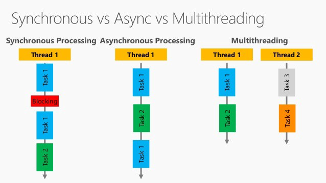

# **node introduction**

node.js est un **asynchronous event-driven JavaScript runtime** qui permet d'éxecuter du code javascript sur votre système d'exploitation.  
Votre code javascript est ainsi executé dans un environement monothread, non bloquant, privilégeant ainsi la programmation d'application suivant une architecture orientée événements (_event driven architecture_).


<br/><br/>

## **command line**

Executer node sur votre ligne de commande vous donne accès au REPL (read-eval-print-loop) qui est l'interpreteur javascript interactif.

```zsh
% node
Welcome to Node.js v15.1.0.
Type ".help" for more information.
>
```

Vous pouvez ainsi exécuter du code javascript:

```js
> let name = 'HardFork'
> let msg = `Hello, ${name}`
> console.log(msg)
Hello, HardFork
```

Vous avez aussi accès à une calculatrice intégrée, facilement accessible:

```js
> (3 + 5 + 7) / 5 * 3 ** 10
177147
```

## **Execute javascript files**

_hello.js_:

```js
// hello.js
let name = 'HardFork'
for (let i = 0; i < 10; ++i) {
  console.log(`Hello, ${name}`)
}
```

```zsh
% node hello.js
Hello, HardFork
Hello, HardFork
Hello, HardFork
Hello, HardFork
Hello, HardFork
Hello, HardFork
Hello, HardFork
Hello, HardFork
Hello, HardFork
Hello, HardFork
```

## Yarn: package manager

## Introduction

`yarn`, concurrent de `npm` est un package manager.
Il sert à créer un package, et a gérer les dépendances de ce package.
Avec `yarn` nous pouvons créer un package qui contiendra notre application.
`yarn` nous permet de:

- Créer un package normalisé avec une structure
- Gérer les dépendances de ce package: installation de librairies, d'outils...
- D'exécuter l'application contenue dans ce package (si c'est une application)
- D'exporter nos propres fonctions et code pour ceux qui veulent s'aider de notre package pour programmer (si c'est une librairie)
- Gérer notre application avec une suite d'outils: tests, déploiements,
- De distribuer notre package plus facilement, via github ou https://www.npmjs.com/

Ce qu'il faut retenir, et c'est important, à partir de maintenant:

- Notre répertoire de travail est reconnu par notre système d'exploitation comme un simple dossier.
- Notre répertoire de travail est aussi un package, reconnu par la commande `yarn`.
- Notre répertoire de travail est aussi un repository `git`, reconnu par la commande `git`.
  Ainsi notre répertoire de travail, puisque aussi un repository `git`, peut être déployé sur `github`.

Très peu probable, sauf pour de petits travaux en local sur votre machine, mais il est possible qu'un package ne soit pas un repository `git`, si on ne souhaite pas y intégrer de `version control system` (très peu probable).

## Installation

Installer `yarn` globalement avec:

```zsh
npm install -g yarn
```

Si `yarn` s'est correctement installé la commande suivante devrait vous retourner la version de `yarn`:

```zsh
yarn --version
1.22.10
```

Il est possible que `yarn` ne soit pas correctement détecté bien que présent sur votre machine.
Il faudra pour cela configurer votre `PATH` pour qu'il contienne le chemin d'accès vers `yarn`.

## **Create a new Project/Package**

Depuis le début nous travaillons avec des fichiers javascript, indépendants, enregistrés dans un répertoire qui a été configuré avec `git`.
Nous devons désormais aussi configurer ce répertoire pour qu'il devienne un package.

Désormais l'ensemble de nos travaux seront des packages.

### **Manually**:

- Créer un dossier qui contiendra vos travaux et s'y déplacer.

```zsh
mkdir my-new-project
cd my-new-project
```

- Initialiser le répertoire avec `yarn` pour créer un package.

```zsh
yarn init -y
```

Vous remarquerez qu'un nouveau fichier `package.json`, qui est un fichier au format `json` qui contient toutes les informations concernant votre package, a été généré.

```json
{
  "name": "my-new-project",
  "version": "1.0.0",
  "main": "index.js",
  "license": "MIT"
}
```

**Ficher très sensible que vous n'avez pour le moment pas besoin de modifier à la main**

- Ajouter un fichier `.gitignore` à la racine de votre répertoire de travail pour ignorer certains répertoires lors de vos push.
  Actuellement il faut absolument que `git` ignore le répertoire `nodes_modules` qui contiendra toutes les dépendances de notre packages.  
  Pour information ces dépendances sont aussi des packages.
  _.gitignore_:

  ```text
  .vscode/
  node_modules/
  ```

  Pour un _.gitignore_ plus avancé consulté: https://github.com/github/gitignore/blob/master/Node.gitignore

- Initialiser le répertoire comme repository `git`:

  - créer un nouveau repository sur github (recommandé que ce soit le même nom que celui du répertoire de travail)
  - Entrer les commandes suivantes dans le répertoire de travail:

  ```zsh
  echo "# my-new-project" >> README.md
  git init
  git add .
  git commit -m "first commit"
  git branch -M main
  git remote add origin git@github.com:AbsoluteVirtueXI/my-new-project.git
  git push -u origin main
  ```

## **configuration file: package.json**

https://docs.npmjs.com/files/package.json

## **usefull yarn commands**

Initialize a node.js project:

```zsh
% mkdir my-project
% cd my-project/
% yarn init -y
```

Install a dependency:

```zsh
% yarn add a-package
```

Install a global dependency (not recommended):

```zsh
% yarn global add a-package
```

Install the dependencies defined in a **_package.json_** file:

```zsh
% yarn install
```

Install a dev dependency:

```zsh
% yarn add a-package --dev
```

Upgrade all the dependencies to their latest version:

```zsh
% yarn upgrade
```

Upgrade only one dependency:

```zsh
% yarn upgrade a-package
```

Remove a dependency:

```zsh
% yarn remove a-package
```

Publish a package defined by the **_package.json_** in the current directory:

```zsh
% yarn publish
```

Run scripts defined in your **_package.json_**:
_package.json_:

```json
{
  "name": "my-package",
  "scripts": {
    "build": "babel src -d lib",
    "test": "jest"
  }
}
```

```zsh
% yarn run test
```

is equivalent to:

```zsh
% yarn test
```

<br />

```zsh
% yarn run build
```

is equivalent to:

```zsh
% yarn build
```

For an exhaustive list of all yarn commands check the official documentation: https://classic.yarnpkg.com/en/docs/cli/

## **npm vs yarn**

`npm install` === `yarn`  
`npm install taco --save` === `yarn add taco`  
`npm uninstall taco --save` === `yarn remove taco`  
`npm install taco --save-dev` === `yarn add taco --dev`  
`npm update --save` === `yarn upgrade`  
`npm install taco@latest --save` === `yarn add taco`  
`npm install taco --global` === `yarn global add tac`  
`npm init` === `yarn init`  
`npm link` === `yarn link`  
`npm outdated` === `yarn outdated`  
`npm publish` === `yarn publish`  
`npm run` === `yarn run`  
`npm cache clean` === `yarn cache clean`  
`npm login` === `yarn login` (and logout)  
`npm test` === `yarn test`  
`npm install --production` === `yarn --production`

## Add our first dependency: chalk

Node.js ne nous permet pas naturellement, et facilement, afficher notre texte avec des couleurs.
Nous avons donc besoin d'installer une librairie dans notre package qui peut nous aider pour cela.
Les librairies export des fonctions/objects, que nous importons ensuite dans notre code:

- gain de temps
- gain en productivité
- moins de bugs
- pas besoin de réinventer la roue

Nous allons ajouter comme dépendance le package `chalk`, qui est dédié à l'affichage de texte en couleur pour les applications en ligne de commande.

Toujours se référer à la documentation officielle d'un package/librairie/node modules que l'on veut installer.
Souvent le `README.md` du repository du package sur github contient toutes les informations d'installation et d'utilisation. Il est possible que certains package complexes aient leur documentation sur un site officiel, mais souvent ces ressources seront toujours indiquées dans le `README.md` de leur repository sur github.

Repository de `chalk`: https://github.com/chalk/chalk  
On y retrouve les informations d'installation.

Dans le répertoire de travail entrer cette commande pour installer `chalk`

```zsh
yarn add chalk
```

Un répertoire `node_modules` a été crée. Il contient le package `chalk`, mais aussi toutes les dépendances dont `chalk` à besoin.
Le fichier `package.json` a été modifié automatiquement et contient désormais une nouvelle entrée `dependencies`:

```json
{
  "name": "my-new-project",
  "version": "1.0.0",
  "main": "index.js",
  "license": "MIT",
  "dependencies": {
    "chalk": "^4.1.0"
  }
}
```

Un nouveau fichier `yarn.lock` a été crée, il contient les versions exactes des packages/dépendances installées.  
En général vous n'avez jamais besoin d'ouvrir ce fichier.  
**Ce fichier est auto généré, il ne devra jamais être modifié à la main**

Créons un fichier _hello.js_ qui affichera en boucle "Hello, HardFork":

```js
for (let i = 0; i < 10; ++i) {
  console.log('Hello HardFork!')
}
```

Importons le module `chalk` pour s'en servir dans notre fichier, comme indiqué dans la documentation:

```js
const chalk = require('chalk')

for (let i = 0; i < 10; ++i) {
  console.log('Hello HardFork!')
}
```

Désormais nous pouvons avons accès au module `chalk` par son nom, mais surtout ce qui nous intéresse le plus ce sont les méthodes exposées par ce module.  
Utilisons la méthode `.red` du module `chalk` pour afficher notre texte en rouge.

```js
const chalk = require('chalk')

for (let i = 0; i < 10; ++i) {
  console.log(chalk.red('Hello HardFork!'))
}
```

En lisant la documentation nous remarquons que nous pouvons ajouter certaines propriétés à notre affichage, comme le souligné et le mettre en gras.

```js
const chalk = require('chalk')

for (let i = 0; i < 10; ++i) {
  console.log(chalk.red.underline.bold('Hello HardFork!'))
}
```

ou encore créer un dégradé en se servant de l'index de la boucle

```js
const chalk = require('chalk')
for (let i = 0; i < 10; ++i) {
  console.log(chalk.bold.rgb(10, 100 + i * 10, 200)('Hello HardFork!'))
}
```

Il faut parcourir la documentation pour découvrir les fonctionnalités que l'on peut utiliser avec le package `chalk`

## readline-sync

Package pour s'interfacer avec l'utilisateur via la console.

installation: `yarn add readline-sync`
Documentation: https://github.com/anseki/readline-sync

```js
// showStars.js

const chalk = require('chalk')
const readlineSync = require('readline-sync')

const showStars = (nbBase, reverse, str) => {
  if (!reverse) {
    for (let i = 1; i <= nbBase; ++i) {
      console.log(str.repeat(i))
    }
  } else {
    for (let i = nbBase; i >= 1; --i) {
      console.log(str.repeat(i))
    }
  }
}

let nbBase = readlineSync.question('Nb base ? ')
nbBase = Number(nbBase)
let motif = readlineSync.question('motif ? ')
showStars(nbBase, false, motif)
```

```js
// vote.js

const chalk = require('chalk')
const readlineSync = require('readline-sync')

const MAX_VOTERS = 10

let isRunning = true
let counter = 0

while (isRunning) {
  const userName = readlineSync.question('May I have your name? ')
  const ageStr = readlineSync.question('May i have your age? ')
  const age = Number(ageStr)
  if (age >= 18) {
    ++counter
    console.log(
      chalk.green(`${userName} you can vote, you are voter number ${counter}`)
    )
    console.log('')
  } else {
    console.log(chalk.red(`${userName} you can not vote`))
  }
  if (counter >= MAX_VOTERS) {
    // exit the loop
    isRunning = false
  }
}
console.log('END OF VOTING PROGRAM')
```
